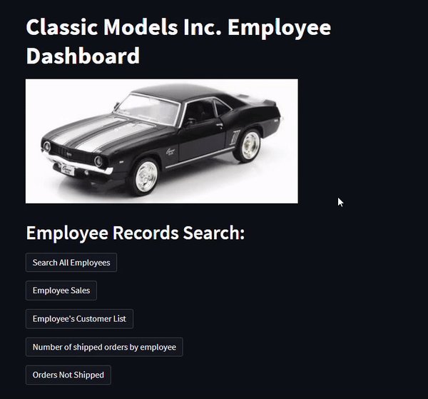

# Internal Sales Interface

## Project Overview
As aspiring data analysts, we wanted our final project to showcase skills that are important in the profession. With this in mind, we created an application written in Python that allows users to query a MySQL database hosted in AWS.

For our database, we used the `classicmodels` database provided by mysqltutorial.org. `classicmodels` is a database containing data for a retailer of scale models of classic cars, planes, motorcycles, and other vehicles. 

We used Amazon RDS to host the database and connected it to MySQL workbench. From MySQL workbench we were able to test queries that would pull different information, such as employee, customer, and sales data. We then used Python and Streamlit to design a web interface that would allow the user to execute the queries in a simple way.

---

## Installation and Usage

In order to run the application, you must have Python installed as well as its modules Streamlit, Pandas, SQLAlchemy, and PyMySQL. The `classic_models_employee_dashboard.py` file contains the code for the main application. It uses the `start_rds_connection` function from `connector.py` to connect to the database in RDS. This function takes the database credentials from a `config.py` file. We needed to use SQLAlchemy to load dataframes to display the information, so we also created a database connection string that pulls the credentials from the same config file. 

We have included a dummy config file in the repository so that the user can easily type in the database credentials in the right format. After entering the credentials, rename the dummy config file to `config.py` so that the other files can access it. The dummy config file looks like this:

```python
import pymysql

USERNAME = "<username>"
PASSWORD = "<password>"
ENDPOINT = "<endpoint>"
PORT = 3306
REGION = "us-west-2d"
DBNAME = "<dbname>"
SSL_CA = "./SSL/global-bundle.pem"
CURSORCLASS = pymysql.cursors.DictCursor
```

Once the credentials have been configured and all of the required modules are installed in the development environment, the application can be launched locally in a web browser. To do this, use your terminal to navigate to the main directory of the repository. Then type `streamlit run classic_models_employee_dashboard.py`.


In the left sidebar of the application there is a text box to type in your employee number. This number will be used to search the employee's sale and customer list. To see a list of all of the employees and their numbers, click the "Search All Employees" button.



After typing in the employee number in the sidebar, the user can click the "Employee Sales" and "Employee's Customer List" buttons to display that information for the specified employee.


The application can also display information such as number of shipped orders by employee, orders not yet shipped, and inventory status by product line or vendor.

In addittion to to displaying information, users can also add new customer information to the database and update existing customer information. To add a new customer to the database, enter the customer's information into the text boxes and click the "Enter Customer" button.


Finally, there is the option to update customer records. This is done by entering the customer's number, selecting the information to be updated, entering the new information, and pressing the "Update Information" button.


---

## Technologies

* Python 3
* Python Modules: Streamlit, PyMySQL, SQLAlchemy, Pandas
* MySQL
* Amazon RDS

---

## Contributors

**Amrita Prithiani** - [Github](https://github.com/amritaprithiani) - [LinkedIn](https://www.linkedin.com/in/amrita-prithiani-2abb6517/) - [Email](mailto:amritaprithiani@gmail.com)

**Ryan Granston** - [Github](https://github.com/RGranston) - [LinkedIn](https://www.linkedin.com/in/ryan-granston-58ab1251/) - [Email](mailto:ryan.granston@gmail.com)

**Lydia Ciummo** - [Github](https://github.com/lydiaciummo) - [LinkedIn](https://www.linkedin.com/in/lydia-ciummo/) - [Email](mailto:lydiaciummo@hotmail.com)

**Ben Spiegel** - [Github](https://github.com/brspiegel) - [LinkedIn](https://www.linkedin.com/in/benrspiegel/) - [Email](mailto:brspiegel@gmail.com)